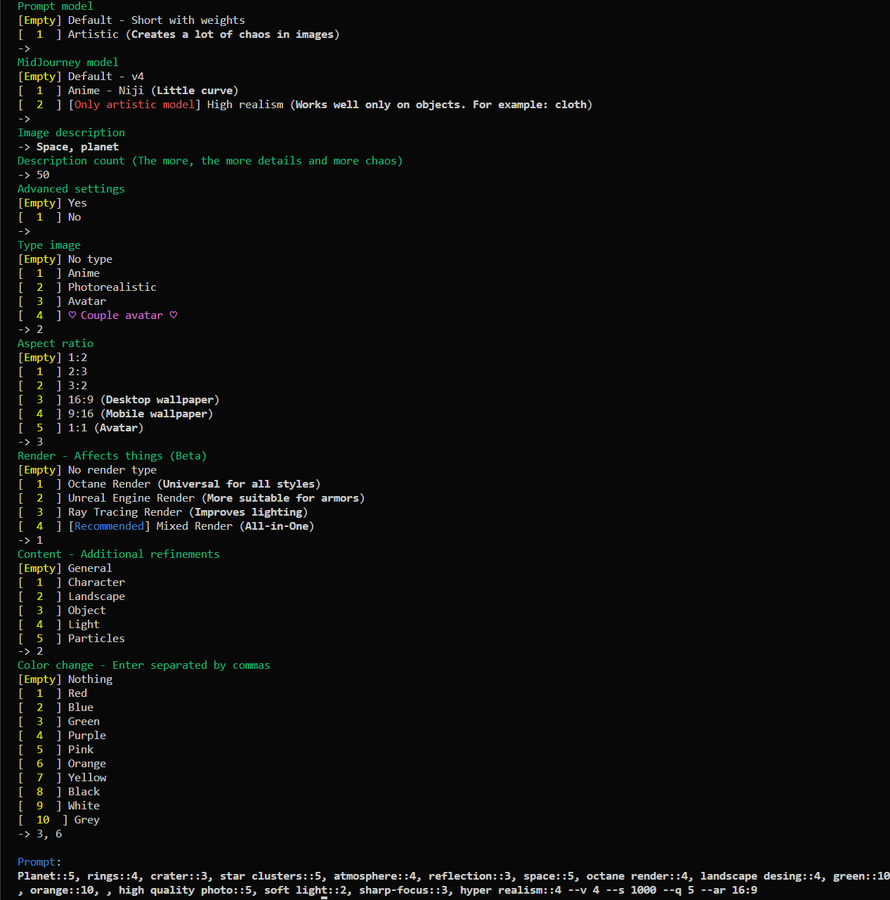

# chatGPT-MidJourney-prompt

This is a ChatGPT based prompt generation model for MidJorney. The purpose of this model is to simplify the creation of images and increase their creativity. By introducing a partial hint, ChatGPT creates a follow-up that can be used to stimulate creativity and provide new ideas.

## What's new
>
> 04.03.2023
>
Added `--no` negations to short-weights model. So far, there may be some shortcomings. If there are any problems, then create an [issue](https://github.com/awekrx/ChatGPT-MidJourney-prompt/issues).
I would be very grateful for your response.

## Examples

_See more examples in my [gallery](https://github.com/awekrx/MidJourney-Arts)_

### Short-weights model

> prompt: `Sakura blossoms::5, pink flowers::4, Licorice plant::3, Japanese landscape::5, octane render::4, landscape desing::4, red::10, purple::10, , high quality photo::5, soft light::2, sharp-focus::3, hyper realism::4 --v 4 --s 1000 --q 5 --ar 16:9`

<p align="center">
<image
  src="./images/arts/2.png"
  width="512"
  alt="V4"
  >
</p>

> prompt: `Stars::5, galaxy::4, space::5, , , , --v 4 --ar 3:2 --s 1000 --q 5 --ar 1:2`

<p align="center">
<image
  src="./images/arts/3.png"
  width="512"
  alt="V4"
  >
</p>

## Artistic model

> prompt: `Elven assassin with a masked face and intricate runes. Highly detailed photorealism showcases the intricate details of the mask and runic markings. Focused on the assassin's face, with a blurred background. The lighting is a blend of candlelight and twilight, adding a sense of mystery to the character. The style is a mix of ancient and fantasy. Resolution: --ar 16:9 --s 1000 --q 2 --upbeta --v 4`

<p align="center">
<image
  src="./images/arts/4.png"
  width="512"
  alt="V4"
  >
</p>

> prompt: `An elven warrior girl wielding a sword, dressed in armor made of intricate metals and fabrics. She stands against a futuristic background with high-tech elements, rendered with the latest technologies. Focused, blurred background, full-body::5 soft light::1 high quality photo::1 --v 4 --ar 3:2 --s 1000 --q 5`

<p align="center">
<image
  src="./images/arts/5.png"
  width="512"
  alt="V4"
  >
</p>
<p align="center">

## Niji

> prompt: `Stray dog::3, samurai::5, katana::5, dirt road::3, countryside::3, --niji --q 2`

<p align="center">
<image
  src="./images/arts/1.png"
  width="512"
  alt="Niji"
  >
</p>

## Getting Started

### Installing

Clone this repository to your local machine:

```bash
git clone https://github.com/awekrx/СhatGPT-MidJourney-prompt.git
```

Then install the required packages:

```bash
pip install -r requirements.txt
```

## Usage

### Edit config

Open `config.ini` and add `email` and `password` there if you are not using OAuth authorization.
Otherwise open [ChatGPT](https://chat.openai.com) and get the `__Secure-next-auth.session-token` cookieand write it to the `session-token`.

### Start

```bash
py main.py
```

To use this model, you can input the following commands in the console:

1. Select the prompt model;
   - The short model creates prompts in the format: `Planet::5, rings::4, crater::3, star clusters::5, atmosphere::4, reflection::3, space::5`
   - The art model creates in the format: `A Victorian-style chair with chrome and ornate decorations reflects a distorted image in the water on the ground. The intricate patterns on the chair add an air of sophistication and elegance to any room. Lighting: Candle Light. Style: Victorian. Details: Cell Shading, atmosphere, ray tracing.`
2. Select the mid-journey model;
   - V4 - MidJourney default model;
   - Niji - MidJourney test model for anime;
   - Realistic(testp) - MidJourney test model for maximum realism;
3. Add image description and description count;
   - Anything you wish;
   - You can specify at the beginning of the url the image to generate based on it;
4. Choose advanced settings;

If you choose advanced settings:

1. Select image type;
   - Adds the selected style to the image;
   - Anime - anime cartoon style;
   - Photorealistic - maximum quality details;
   - Avatar - focus on the center of the image;
   - Couple avatar - Especially for creating avatars that you can share with your soulmate ♡;
2. Choose aspect ratio;
   - I think everything is clear here;
3. Choose rendering:
   - Changes the generation style. Object details. You'll understand better if you test it;
4. Choose content refinement;
   - Specifies what exactly we want to see in the image;
   - Combining the character description and, for example, the particle mode, you can get very interesting images;
5. Choose color change;
   - Choose dominant colors separated by commas;



## Alternative usage

You can also use this as a function in python.

```python
from modules.prompt import Prompt
import configparser

config = configparser.ConfigParser()
config.read("config.ini")

auth = {
    "email": config["ChatGPT"]["email"],
    "password": config["ChatGPT"]["password"],
    "session_token": config["ChatGPT"]["session_token"]
}

prompter = Prompt(auth)
prompter.ask()
```

With `prompter.ask()` you can create a prompt.
Parameters:

`text`: A string representing the prompt for generating text.

`count_words`: An optional integer representing the number of words to generate in response to the prompt. The default value is 25.

`type`: An optional integer representing the type of content to generate. This can be one of several values defined in the Settings module. The default value is 0.

`resolution`: An optional integer representing the resolution of the generated content. This can be one of several values defined in the Settings module. The default value is 0.

`renderer`: An optional integer representing the renderer to use for the generated content. This can be one of several values defined in the Settings module. The default value is 0.

`content`: An optional integer representing the type of content to generate. This can be one of several values defined in the Settings module. The default value is 0.

`prompt_model`: An optional integer representing the type of prompt model to use for generating text. This can be one of several values defined in the Settings module. The default value is 0.

`mj_model`: An optional integer representing the type of mid-journey model to use for generating text. This can be one of several values defined in the Settings module. The default value is 0.

`colors`: An optional list of integers representing the colors to use for the generated content. This can be one or more values defined in the Settings module. The default value is an empty list.

`Return`: A string representing the generated text. If the text parameter starts with "http", the function will attempt to extract a URL from the beginning of the string and return the URL along with the generated text.

## License

This project is licensed under the MIT License.

## Acknowledgments

Thanks a lot to the development of AI and separately to [СhatGPT](https://chat.openai.com) for generating the Readme.
And also [acheong08](https://github.com/acheong08) for creating [ChatGPT](https://github.com/acheong08/ChatGPT).

## Future

More generation options:

- styles
- lighting
- artists style
